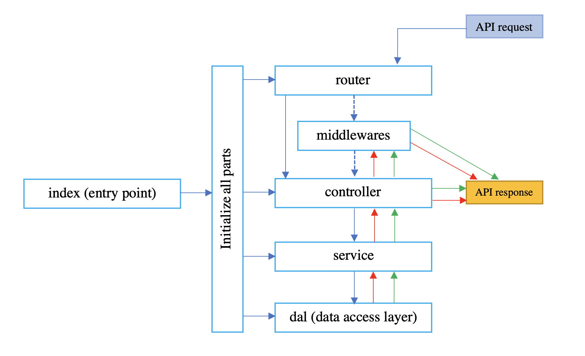

# Node.js server template

## Table of contents
* [General info](#general-info)
* [Technologies](#technologies)
* [Setup](#setup)
* [Style guide](#style-guide)
* [Architecture guide](#architecture-guide)

### General info

### Technologies
Program/lib | version | command for checking\
Git | 2.30.1 | `git --version`\
Node.js | v16.6.1 | `node -v` \
Express | ^4.17.1 | see in app package.json\
Postgres | v14.6 | `postgres --version`\
Mongoose | ^6.0.11 | see in this app package.json\
Mocha | 9.1.3 | see in this app package.json\
Eslint | 8.0.1 | see in this app package.json\
Yarn | 1.22.10 | `yarn -v`

### Setup
1. Clone this repository\
`git clone https://github.com/Vladinho10/builder.git` 
2. Fill in your git credentials (if required)
3. Enter the downloaded directory.\
`cd builder`
4. Create your .env files like `.env` file in envs directory. 
5. Create your db in postgres and add its credentials in .env.local file

for yarn
* install packages\
  `yarn`
* run migrations\
  `yarn run migrate-up`
* import sample data from ./dal/sample-data.csv file
* run server\
  `yarn run start`
  or\
  `yarn start`
* if you want your server stay always running\
  `yarn run nodemon`
  or\
  `yarn nodemon`
* run tests \
  `yarn run test`

for npm
* install packages\
   `npm i`
* run migrations\
   `npm run migrate-up`
* import sample data from ./dal/sample-data.csv file
* run server\
   `npm run start`
   or \
   `npm start`
* if you want your server stay always running\
`npm run nodemon`
* run tests \
  `npm run test`

For more information about APIs, please look at postman and swagger documentations in ./docs directory

## Style guide 
We suggest our ESLint configs which are inspired by AirBnB configs. We are open to any suggestions from contributors if they are inline with our philosophy. \
These ESLint configs are written and tuned for modern JavaScript development. So we don’t support old, outdated JavaScript methods, e.g. 
obj = new Object() this construct because we can just use const obj = {};\
[more](https://github.com/Vladinho10/node-server-template/blob/master/guides/style-guide.md)

## Architecture guide

The software architecture (SA) is one of the most important parts of the software development. It helps developers to easily integrate into the existing codebase.
The architecture describes a set of aspects and decisions of the software. \
[more](https://github.com/Vladinho10/node-server-template/blob/master/guides/architecture-guide.md)
  
